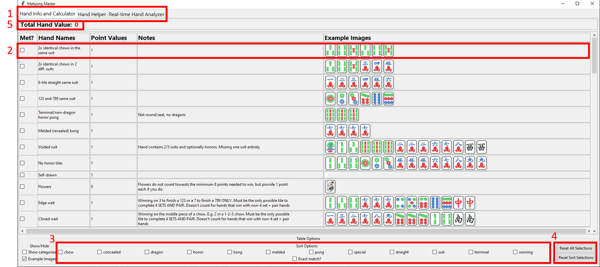
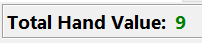
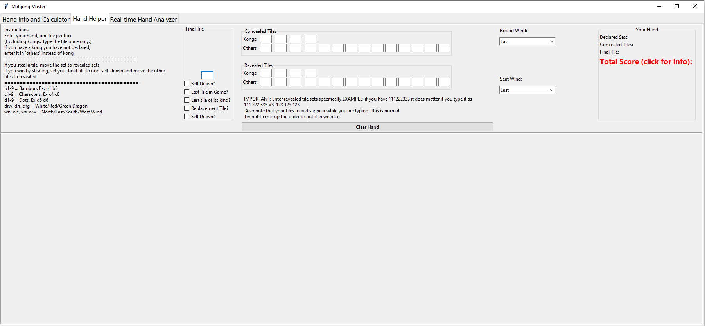
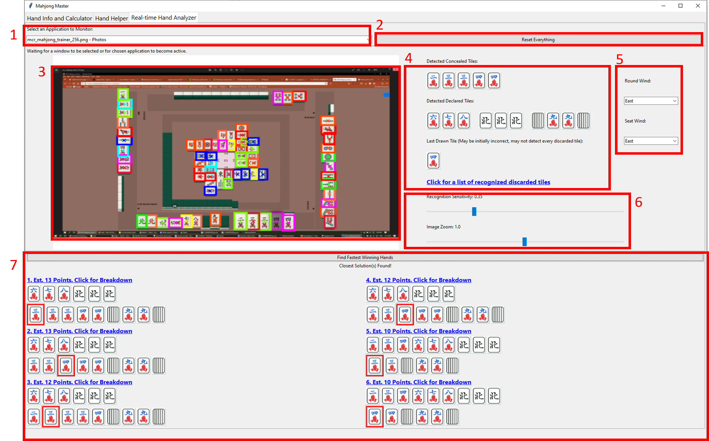
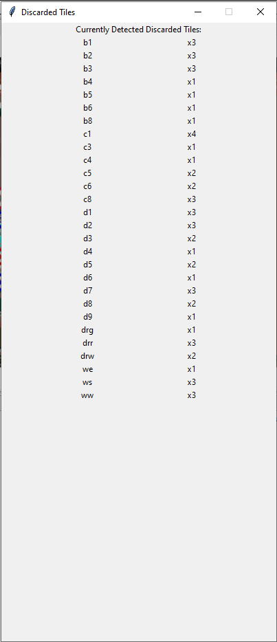
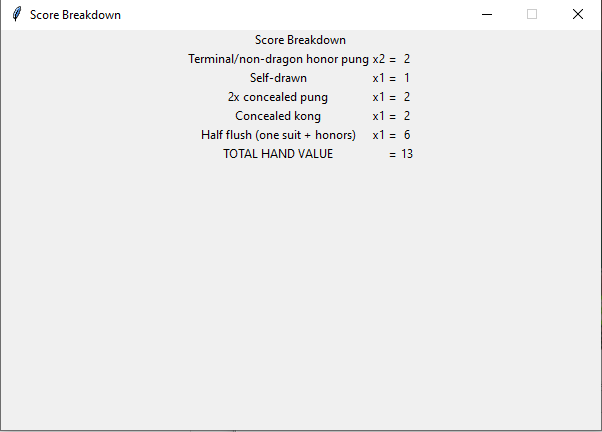

# Requirements

Libraries used (possibly missed one or two) are:
- `tensorflow v2.10.1`
- `OpenCV2`
- `numpy`
- `PIL Fork`
- `pyautogui`
- `win32gui`
- `matplotlib`

Most versions don't matter **except** tensorflow.

# Model Weights

Model weights are too big to check in to git. They are currently in google drive. Download them and move it into the ml_reinvented_wheel folder along with model.json.

Link: https://drive.google.com/file/d/1oZNa_ZZ0GZtKg4r-OBbq9uCRMcZ4FExq/view?usp=sharing

# mahjong_master

Images are taken from the Mahjong Wiki for now, I do not own them or intend to redistribute them for profit. 

http://mahjong.wikidot.com/rules:chinese-official-scoring

I was trying to learn scoring in Mahjong which led to all of this. This project started as an excel spreadsheet which quickly got out of hand and became a python program to help me calculate the score of any given hand. Scoring in Mahjong is quite complicated and even inconsistent due to different interpretation of the rules. Certain conditions can cancel others, and the scoring calculator needs to be smart enough to recognize what is acceptable.

The first page of the program was created for this purpose. I figured, however, if I already have all the point values in then couldn't I make a program where I enter my hand and it scores it automatically? This is what page 2 does. Page 2 is quite rough and user unfriendly, but it achieves its purpose. All of these functions were added on afterward, so the structure and organization wasn't really the best.

After the auto scoring framework was created, I thought that maybe I could also create a solver. As a new player in Mahjong, one of the more difficult aspects is knowing what hands you can work for to win. The goal was to bruteforce the quickest solutions using A* and show a point breakdown so new users could have one less thing on their mind (yes this would count as cheating and should only be used against bots or friends who are aware). After a while, you would hopefully no longer need it.

Later on I decided I wanted to try my hand at image recognition. The base for scoring and solving already existed, but inputting your hand was cumbersome and akward. I knew nothing of image recognition beforehand, so I wanted to use this as a chance to learn. 

### Issues
Since this was done as a random project 'for fun' and none of the features were planned, the organization is not the best. If I were to start over I would rethink all of the classes and their interactions to try and streamline it. Additionally, I had plans to make the solver algorithm smarter, but I never got around to it. As it stands, it tends to fail since I limit the iterations to ~200 so it doesn't take forever. A smarter algorithm could probably find something better. I'm not convinced A* is the best option here, but I don't know enough (currently) about decision AI to improve it. Lastly, it's still somewhat buggy in the image recognition. My dataset is far too small for something like this, but considering I had to manually screenshot and label **every single image**, I got sick of it quick. I would like to use a dataset with different resolutions, different websites, web browsers, tile sets, etc. and with far more photos. I would also consider an implementation that takes each image and augments it a few times and then 'averages' the output to get a more consistent scan to avoid failed scans.

## Page 1 - Hand Info

1. Page select
2. One example from the Mahjong Wiki of a point condition. Clicking the 'Met?' checkbox will add the points to your score.
3. Sorting options. By default, categories are hidden. They can be shown with the 'show categories' checkbox. Clicking an option will show only point conditions with at least one of the tags included. Checking exact match will only show hands that have all of the selected options in their list.
4. Reset sort selection unchecks all sorting options. Reset all completely remakes the page to its default state
5. Shows the total value of your hand based on the conditions you have met. If a condition is canceled by another, it will not be included. The text turns green when you have >= 8 points
   

## Page 2 - Deprecated

This page was what I used to develop the auto-scoring functionality. Its purpose has been improved on page 3, but could still be used if you really want to, or if the scanner is failing.

## Page 3 - Real-time Analyzer

Now with slightly less poor scanning! I recognize the irony when the screenshot I took has multiple failed scans. We can't all be perfect, ok? My dataset is way too small.

This app reads an application of your choice and scans it for Mahjong tiles. At the moment it's limited to mahjongsoft.com because I couldn't be bothered to create a larger dataset since it is entirely manual.
1. Select an application here. Most often a web browser with an active game running. Note that it will only scan while that app is active. Tabbing out or selecting the mahjong master program will pause scanning.
2. Reset EVERYTHING. This essentially unmakes and remakes the entire application.
3. A preview of your application and what the scanner recognizes. This is updated roughly once a second, and the colored boxes indicate recognized tiles with a high confidence. The 'x' is the center point of the box surrounding the tile and has nothing to do with which tile it thinks it is.
4. This part shows a representation of what the scanner thinks is in your hand (assuming your hand is at the bottom of the screen). If you click the blue text a box will pop up showing every tile it thinks is discarded. This includes sets in other people's hands since they also cannot be obtained by you.

5. An important part of scoring is your seat wind and round wind. These dropdown boxes let you select your current seat/round wind.
6. The scanner may not always be correct (due to a limited dataset). Sensitivity allows you to adjust the threshold for detecting if a tile exists (but not which tile it is, simply if it exists). Image zoom will slightly zoom in or out on the image to possibly make the scanner trigger better.
7. Similar to the one on page 2 (which I didn't show) you can select the 'find closest winning hands' button when a hand has been detected to run A* and try and find the closest hand that meets the minimum score (based on number of turns needed to achieve it). The tiles you need to obtain are highlighted in red. Clicking on one of them opens a popup that explains the score breakdown.

## Training

This network is based of the YOLOv2/3 architecture for object detection. I initially though about other architectures like YOLOv1, but since I have many objects in close areas with the possibility of them all being the same class, I had to use a more advanced version of YOLO. The model described in `ml_reinvented_wheel/yolo_model.py` is not exactly the same, but structurally very similar. I tweaked the sizes and layers to be more appropriate for my application. Also, I chose a different grid size where I could be sure I had no more than a few tiles in a given grid cell. This is checked via the `check_if_grid_size_and_bbox_num_large_enough()` function in `ml_reinvented_wheel/input_output_utils.py` file. Since most tiles have similar aspect ratios, I chose to have 6 boxes per grid cell with 3 aspect ratios all repeated once each to detect up to two of the same type of shape in each cell.

The `yolo_loss()` function within `ml_reinvented_wheel/yolo_model.py` is by far the most critical part. Since there was no clear loss function defined, I took inspiration from [fairyonice's](https://fairyonice.github.io/Part_4_Object_Detection_with_Yolo_using_VOC_2012_data_loss.html) blog post about implementing yolo. The loss function is similar in some regards to the original YOLOv1 loss function but with extra terms to deal with anchor boxes. YOLOv1 used predetermined boxes, so that part doesn't fit in. 

I chose to modify a few things since I thought there were some errors in this implementation. I also added a lot of comments because some of it was confusing. The comments reference a 13x13 grid because that was my initial size choice, but ultimately I had too many objects per grid cell so I increased it to 33x33 in `ml_reinvented_wheel/yolo_globals.py`.

By far, the biggest issue with this project is the limited dataset. I used the script `ml_reinvented_wheel/auto_screenshot_taker.py` to take screenshots every 5 seconds while I was playing. I then had to manually label every single image of the hundreds of screenshots I took. I got tired of it and gave up after a while, accepting poorer performance because I simply could not keep labeling without losing my sanity. If somehow a large dataset appeared in the future, I might go back and improve this.

In an attempt to salvage my laziness, `ml_reinvented_wheel/input_output_utils.py` contains functions that will augment my dataset in a number of ways. Currently there are functions to shift an image left/right/up/down a random amount, zoom in or out by a percentage and brighten or darken an image. All of these also modify the labels locations if necessary. They can also be combined together, which is what I did. I did multiple passes on my image directory to create something like 8x the number of images to make up for a small data set.

I also found that slowing the learning rate initially helped significantly in getting to a good state.

`ml_reinvented_wheel/main_train.py` The main file to run to train the network. This file augments the dataset, loads up the model and runs the fit command.

`ml_reinvented_wheel/yolo_globals.py` Contains all the settings, anchor boxes, image sizes, class names and more for the whole project.

`ml_reinvented_wheel/kmeans_for_anchor_boxes.py` Contains a script to vizualise the aspect ratios in the dataset to help choose anchor boxes.
